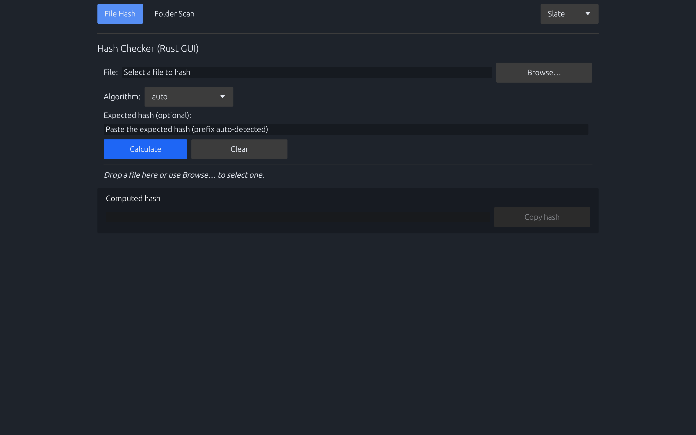

# Hash Checker

[](https://github.com/tamld/hash-checker/actions/workflows/ci.yml)


> Cross-platform integrity checker with a shared Rust core powering CLI and egui desktop apps.

## Table of Contents
- [Overview](#overview)
- [Feature Highlights](#feature-highlights)
- [Clone & Workspace Setup](#clone--workspace-setup)
- [Quick Start (Containerised)](#quick-start-containerised)
- [Manual Host Build](#manual-host-build)
- [Installer Builds](#installer-builds)
- [Verify Downloads](#verify-downloads)
- [Temporary Artefacts](#temporary-artefacts)
- [Continuous Integration](#continuous-integration)
- [Project Documents](#project-documents)

## Overview
Hash Checker delivers reproducible, container-friendly workflows for validating file hashes across Windows, macOS, and Linux. The project is fully Rust-based and uses Docker/Vagrant helpers to keep host systems clean.

## GUI Preview

*High-contrast mode with result panel and clipboard actions.*

> Quy trình cập nhật ảnh được mô tả trong `docs/GUI_SCREENSHOT.md`.

## Feature Highlights
- Multiple algorithms: SHA-2 family, SHA-1, MD5, BLAKE2.
- Automatic algorithm detection based on digest length.
- Command-line and egui desktop interfaces sharing the same Rust core.
- Container-first workflows (Docker/Vagrant) to avoid host pollution.
- Built-in clipboard workflow (copy computed hashes) and accessibility toggles for the GUI.

## Clone & Workspace Setup
```bash
# Clone the public repository
git clone https://github.com/tamld/hash-checker.git
cd hash-checker

# (Optional) work inside the assistant workspace layout
cd local-scripts/hash-checker
```
> Note: all scripts/Make targets assume you are inside the repository folder (`hash-checker/` or `local-scripts/hash-checker/`). Update your own remote/fork if you are contributing from a fork.

## Quick Start (Containerised)
Prerequisites: Docker (build/test) and Vagrant + VMware Fusion (optional, for headless GUI smoke tests).

| Command | Purpose |
| --- | --- |
| `make rust-test` | Run Rust CLI unit/integration tests inside Docker |
| `make rust-build` | Build Rust CLI release binary in Docker |
| `make rust-gui-build` | Build Rust GUI release binary in Docker (installs GTK) |
| `make rust-gui-smoke` | Launch Vagrant VM and run `cargo run -- --smoke-test` |
| `make rust-build-temp` | Build CLI+GUI in Docker and copy artefacts to `/tmp/hash-checker-build` |
| `make clean` | Remove build artefacts and prune Docker volumes |
| `make cleanup-packaging` | Remove packaging staging directories (`dist/linux`, `target/packager`, `/tmp/hash-checker-*`) |

## Manual Host Build
Prefer building locally? With Rust installed:

```bash
# CLI
cargo build --release --manifest-path rust/hash-checker/Cargo.toml

# GUI (ensure system GTK deps on Linux/macOS)
cargo build --release --manifest-path rust/hash-checker-gui/Cargo.toml
cargo run --release --manifest-path rust/hash-checker-gui/Cargo.toml -- --smoke-test
```

Equivalent Make targets:
```bash
make rust-build-host
make rust-gui-build-host
make rust-gui-smoke-host
```

## Installer Builds
- Install the packager once per machine: `cargo install cargo-packager@0.11.7 --locked`.
- From `rust/hash-checker-gui/`, run `cargo packager --release --formats dmg` (macOS) or `cargo packager --release --formats deb appimage pacman` (Linux) to produce native installers.
- Windows CI publishes both the portable `hash-checker-windows-portable.zip` archive and an NSIS installer executable.
- Windows packaging consumes the multi-resolution icon at `docs/assets/icon-hash-checker.ico` so the executable/installer display the Hash Checker branding.
- macOS artefacts are currently unsigned; users can Control-click → **Open** or clear quarantine with `xattr -d com.apple.quarantine "/Applications/Hash Checker.app"`.

## Verify Downloads
- Each release ships a `SHA256SUMS` file; download it alongside the installer/binary.
- On macOS/Linux run `shasum -a 256 <artefact>` and compare with the recorded digest (`grep <artefact> SHA256SUMS`).
- On Windows run `Get-FileHash <artefact> -Algorithm SHA256` or use the CLI binary and the recorded digest.
- Full command examples for every platform (including upcoming signature validation) live in `docs/security/VERIFICATION_GUIDE.md`.
- macOS build currently ships arm64 DMG; Intel users will need the upcoming universal DMG (tracked in PLAN/TASKS) or build from source.
- Current status: Windows artefacts are unsigned while the SignPath integration is pending; always verify using the guide above. macOS DMG remains unsigned—follow Gatekeeper instructions in the README.

### macOS Gatekeeper (Unsigned Build)

Gatekeeper sẽ cảnh báo khi mở DMG/app chưa được notarise. Làm theo các bước sau để chạy bản phát hành hiện tại:

1. Tải và giải nén DMG từ trang phát hành của Hash Checker.
2. Mở Finder, nhấp chuột phải vào `Hash Checker.app` rồi chọn **Open**.
3. Trong hộp thoại cảnh báo, tiếp tục chọn **Open** để xác nhận.

Nếu muốn tắt cờ quarantine thủ công (ví dụ khi copy app ra `/Applications`):

```bash
xattr -d com.apple.quarantine "/Applications/Hash Checker.app"
```

Sau khi SignPath hoặc notarisation được thiết lập, phần này sẽ được cập nhật tương ứng.

## Temporary Artefacts
Need binaries quickly without touching the repo tree?

```bash
make rust-build-temp
ls /tmp/hash-checker-build
```
Produces `hash-checker`, `hash-checker-gui`, and `SHA256SUMS` in `/tmp/hash-checker-build`.

Platform-specific packages can also be generated into temp directories:

```bash
make rust-gui-dmg-temp        # -> /tmp/hash-checker-gui/*.dmg (macOS)
make rust-linux-deb-temp      # -> /tmp/hash-checker-deb/*.deb (Linux build from mac host via cargo-packager)
make rust-windows-zip-temp    # -> ${TMPDIR:-/tmp}/hash-checker-win/hash-checker-windows-portable.zip (use %TEMP%\hash-checker-win on native Windows)
```

## Continuous Integration
- `.github/workflows/ci.yml` runs macOS and Windows on every push/PR. Linux is opt-in and should be triggered manually via `gh workflow run` once the local gate passes.
- Each job now focuses on formatting, linting, unit/smoke tests. Packaging of installers happens only in the release workflow (tags or manual dispatch).
- Docker helpers ensure build outputs remain accessible between steps.
- Before pushing, run `make ci-linux-local` to execute fmt/clippy/tests inside a Docker container and store logs under `logs/`.
- Execute `make deps-refresh` during the monthly maintenance cadence to update dependencies and log security scans.
- Store any sensitive planning docs under `docs/private/` (ignored by git) so the public repo remains clean.

## Project Documents
- Roadmap overview: `docs/PLAN.md`
- Active task tracker: `docs/TASKS.md`
- Backlog & long-term ideas: `docs/BACKLOG.md`
- Security strategy: `docs/SECURITY_ROADMAP.md`
- Threat model summary: `docs/security/THREAT_MODEL.md`
- Download verification (checksum, GPG, Authenticode): `docs/security/VERIFICATION_GUIDE.md`
- CI signing integration (SignPath + GPG): `docs/security/CI_SIGNING.md`
- Release operations & runner strategy: `docs/OPERATIONS.md`
- Windows signing playbook: `docs/SIGNING.md`
- Dependency migration plan: `docs/DEPENDENCY_MIGRATION.md`
- GUI architecture notes: `docs/GUI_DECISION.md`, `docs/GUI_MVP_DESIGN.md`
- Repo guardrails: `.agent/AGENTS.md`
- Contributor behaviour: `CODE_OF_CONDUCT.md`
